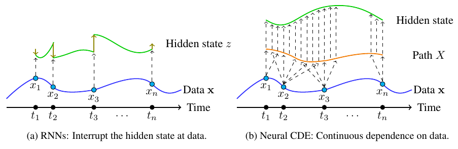
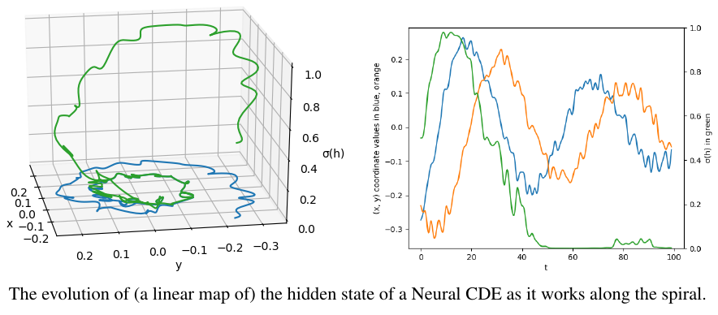
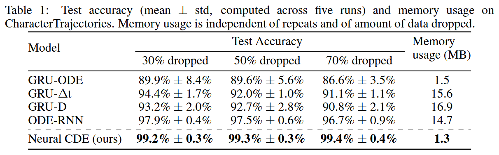

<h1 align='center'> Neural Controlled Differential Equations for Irregular Time Series<br>(NeurIPS 2020 Spotlight)<br>
    [<a href="https://arxiv.org/abs/2005.08926">arXiv</a>, <a href="https://www.youtube.com/watch?v=sbcIKugElZ4">YouTube</a>] </h1>

<p align="center">

</p>

Building on the well-understood mathematical theory of _controlled differential equations_, we demonstrate how to construct models that:
+ Act directly on irregularly-sampled partially-observed multivariate time series.
+ May be trained with memory-efficient adjoint backpropagation - even across observations.
+ Demonstrate state-of-the-art performance.

They are straightforward to implement and evaluate using existing tools, in particular PyTorch and the [`torchcde`](https://github.com/patrick-kidger/torchcde) library.

----

### Library
See [`torchcde`](https://github.com/patrick-kidger/torchcde).

### Example
We encourage looking at [example.py](https://github.com/patrick-kidger/torchcde/blob/master/example/example.py), which demonstrates how to use the library to train a Neural CDE model to predict the chirality of a spiral.

Also see [irregular_data.py](https://github.com/patrick-kidger/torchcde/blob/master/example/irregular_data.py), for demonstrations on how to handle variable-length inputs, irregular sampling, or missing data, all of which can be handled easily, without changing the model.

A self contained short example:
```python
import torch
import torchcde

# Create some data
batch, length, input_channels = 1, 10, 2
hidden_channels = 3
t = torch.linspace(0, 1, length)
t_ = t.unsqueeze(0).unsqueeze(-1).expand(batch, length, 1)
x_ = torch.rand(batch, length, input_channels - 1)
x = torch.cat([t_, x_], dim=2)  # include time as a channel

# Interpolate it
coeffs = torchcde.natural_cubic_spline_coeffs(x)
X = torchcde.NaturalCubicSpline(coeffs)

# Create the Neural CDE system
class F(torch.nn.Module):
    def __init__(self):
        super(F, self).__init__()
        self.linear = torch.nn.Linear(hidden_channels, 
                                      hidden_channels * input_channels)
    def forward(self, t, z):
        return self.linear(z).view(batch, hidden_channels, input_channels)

func = F()
z0 = torch.rand(batch, hidden_channels)

# Integrate it
torchcde.cdeint(X=X, func=func, z0=z0, t=X.interval)
```

<p align="center">

</p>

### Reproducing experiments
Everything to reproduce the experiments of the paper can be found in the [`experiments` folder](./experiments). Check the folder for details.

### Results
As an example (taken from the paper - have a look there for similar results on other datasets):

<p align="center">

</p>

### Citation
```bibtex
@article{kidger2020neuralcde,
    title={{N}eural {C}ontrolled {D}ifferential {E}quations for {I}rregular {T}ime {S}eries},
    author={Kidger, Patrick and Morrill, James and Foster, James and Lyons, Terry},
    journal={Advances in Neural Information Processing Systems},
    year={2020}
}
```
